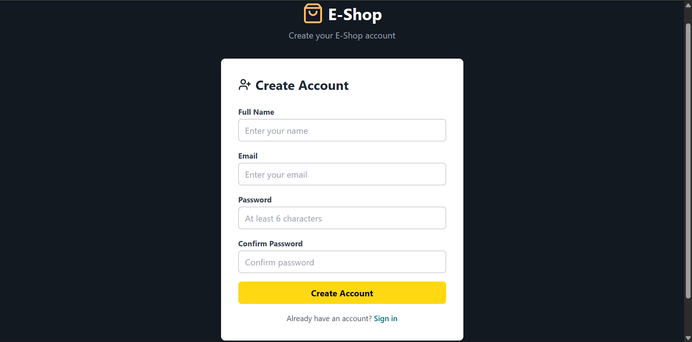
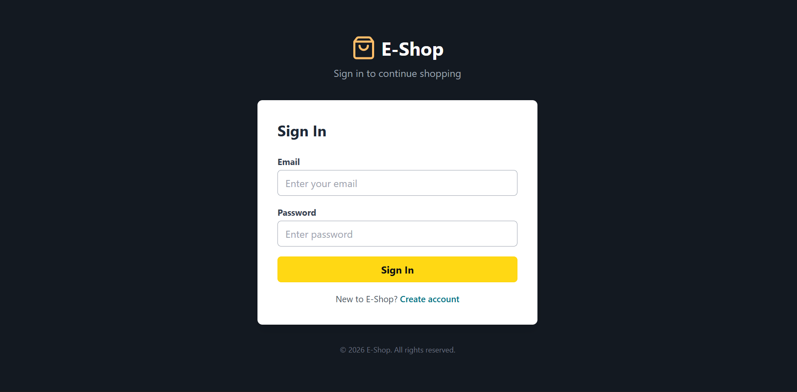
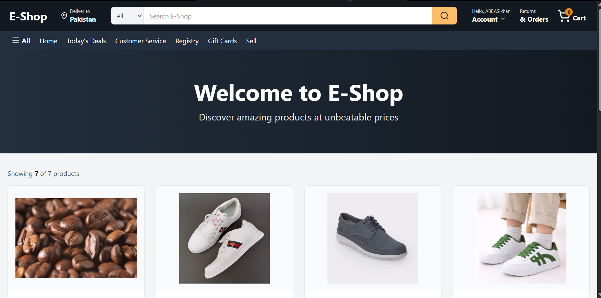
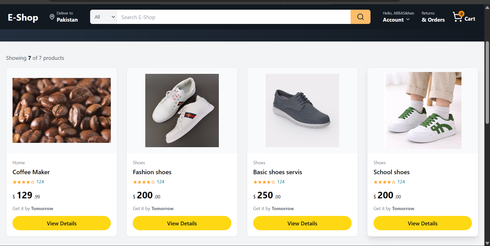
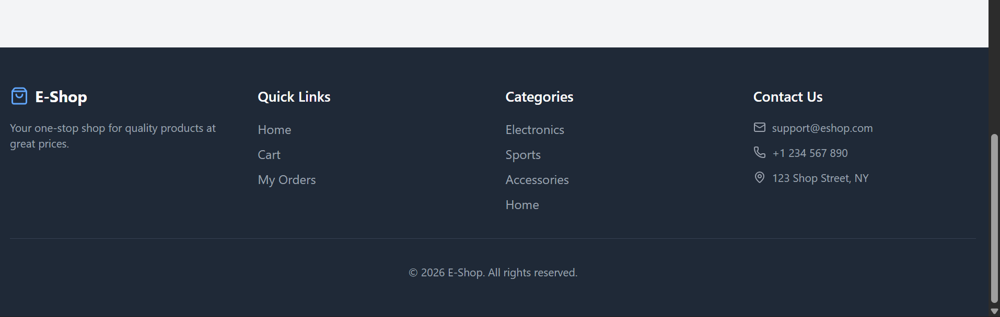
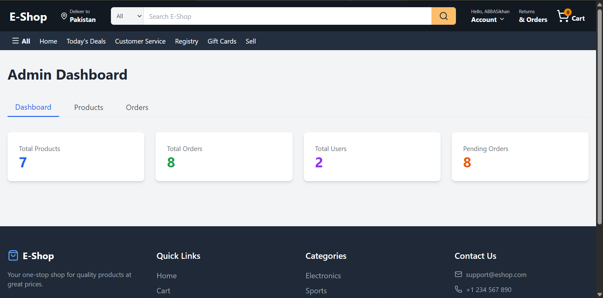
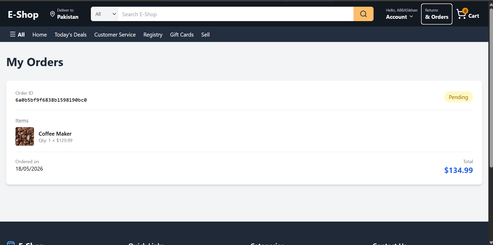
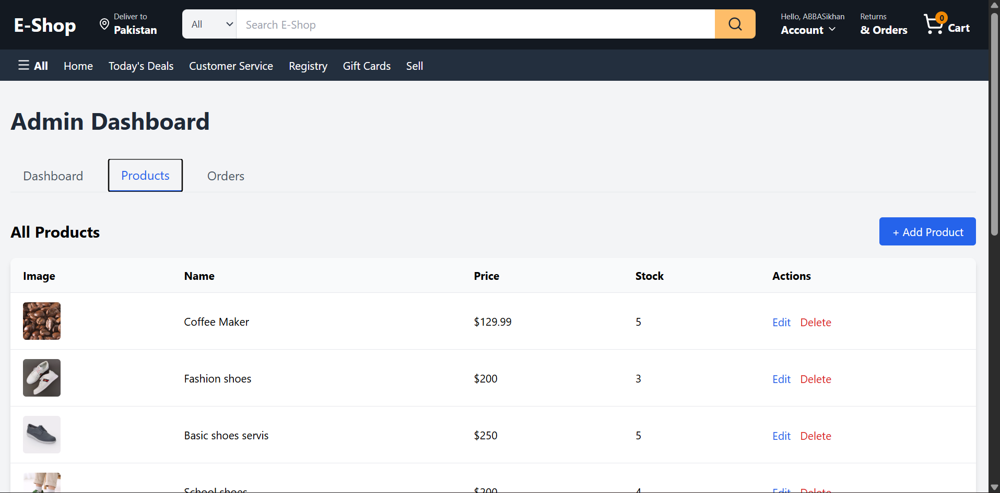
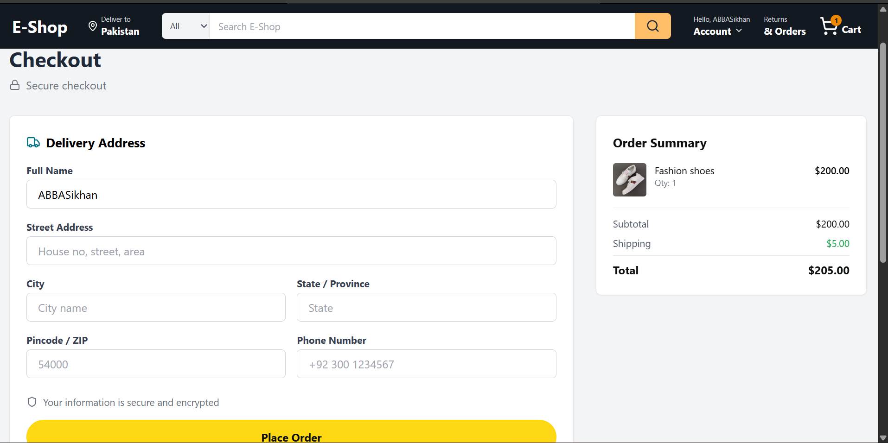

# 🛒 E-Shop — Full Stack E-Commerce Platform

A modern, full-featured e-commerce platform built with the MERN stack. E-Shop provides a seamless shopping experience for customers and a powerful admin dashboard for store management.

---

## ✨ Features

### 👤 User Features
- 🔐 **Authentication** — Register/Login with JWT tokens
- 🏠 **Home Page** — Browse all products with search and category filters
- 🔍 **Search & Filter** — Real-time product search by name, filter by category, sort by price
- 🛍️ **Product Details** — View product info with image, price, stock, and add to cart
- 🛒 **Shopping Cart** — Add, update quantity, remove items with persistent localStorage
- 💳 **Checkout** — Secure order placement with shipping information
- 📦 **My Orders** — View order history with status tracking
- 📱 **Responsive Design** — Works on mobile, tablet, and desktop

### 🛠️ Admin Features
- 📊 **Dashboard** — View stats: total products, orders, users, pending orders
- ➕ **Add Products** — Create new products with all details
- ✏️ **Edit Products** — Update product name, price, stock, image, category
- 🗑️ **Delete Products** — Remove products from store
- 📋 **Manage Orders** — View all customer orders and update order status
- 👥 **User Management** — Role-based access control

---

## 🧰 Tech Stack

| Layer | Technology |
|-------|------------|
| **Frontend** | React 19, React Router DOM, Context API |
| **Backend** | Node.js, Express.js |
| **Database** | MongoDB Atlas, Mongoose |
| **Tools** | Vite, Tailwind CSS |

---

## 🚀 Getting Started

### Prerequisites
- Node.js (v18+)
- MongoDB Atlas account (or local MongoDB instance)

### Installation

1. **Clone the repository**
   ```bash
   git clone https://github.com/yourusername/e-shop.git
   cd e-shop

# Install server dependencies
cd server
npm install

# Install client dependencies
cd ../client
npm install


# Create a .env file in the server directory:
PORT=5000
MONGODB_URI=your_mongodb_atlas_connection_string
JWT_SECRET=your_jwt_secret_key


# Run the Application
# Start the backend server
cd server
npm run dev

# Start the frontend (in a new terminal)
cd client
npm run dev

# Open the browser
http://localhost:5173


# Projecgt Structure
e-shop/
├── client/                 # React frontend
│   ├── src/
│   │   ├── components/     # Reusable UI components
│   │   ├── context/        # Context API state management
│   │   ├── pages/          # Page components
│   │   └── App.jsx
│   └── public/
├── server/                 # Express backend
│   ├    
│   ├── models/             # Mongoose models
│   ├── routes/             # API routes
│   ├── middleware/         # Auth & validation middleware
│   └── server.js
└── README.md


# Authentication
The app uses JWT (JSON Web Tokens) for secure authentication:
.Tokens are stored securely and sent with each protected request
.Role-based access control separates user and admin privileges
.Passwords are hashed before storage

# Screenshots of E-commerce website











 # API Endpoint

| Method | Endpoint             | Description                 |
| ------ | -------------------- | --------------------------- |
| POST   | `/api/auth/register` | Register new user           |
| POST   | `/api/auth/login`    | Login user                  |
| GET    | `/api/products`      | Get all products            |
| GET    | `/api/products/:id`  | Get single product          |
| POST   | `/api/products`      | Add new product (Admin)     |
| PUT    | `/api/products/:id`  | Update product (Admin)      |
| DELETE | `/api/products/:id`  | Delete product (Admin)      |
| POST   | `/api/orders`        | Place order                 |
| GET    | `/api/orders`        | Get user orders             |
| GET    | `/api/orders/all`    | Get all orders (Admin)      |
| PUT    | `/api/orders/:id`    | Update order status (Admin) |


# License
This project is licensed under the MIT License.

# Author
Muhammad Abbas — [GitHub ] https://github.com/Muhammad-7Abbas  · [LinkedIn] Muhammad Abbas

Built with ❤️ using React, Node.js, and MongoDB
